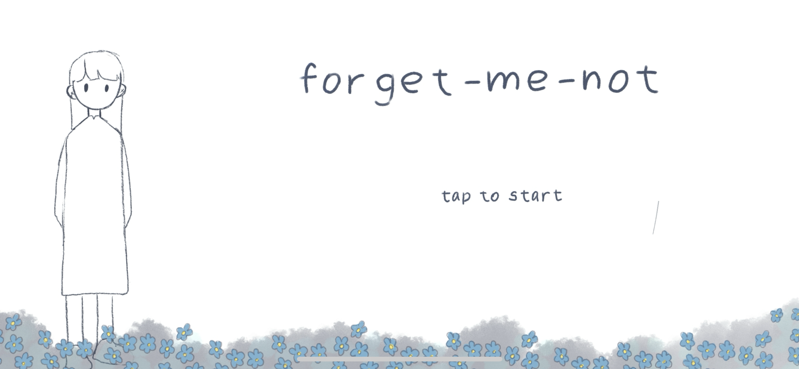

# ❀ Forget-me-not
Swift Student Challenge 2025 – Winner

Forget-me-not é uma experiência narrativa interativa desenvolvida em Swift. O projeto explora a etapa de aceitação do luto através de momentos sutis, interações simples e uma atmosfera serena que convida à reflexão.
A proposta não é buscar um final perfeito, mas mostrar que ainda é possível encontrar tranquilidade: apreciar amigos, bons cafés, tardes silenciosas e horizontes bonitos — mesmo convivendo com a ausência. Com o tempo, o vazio deixa de ser um fantasma e se torna um espaço de memória.

